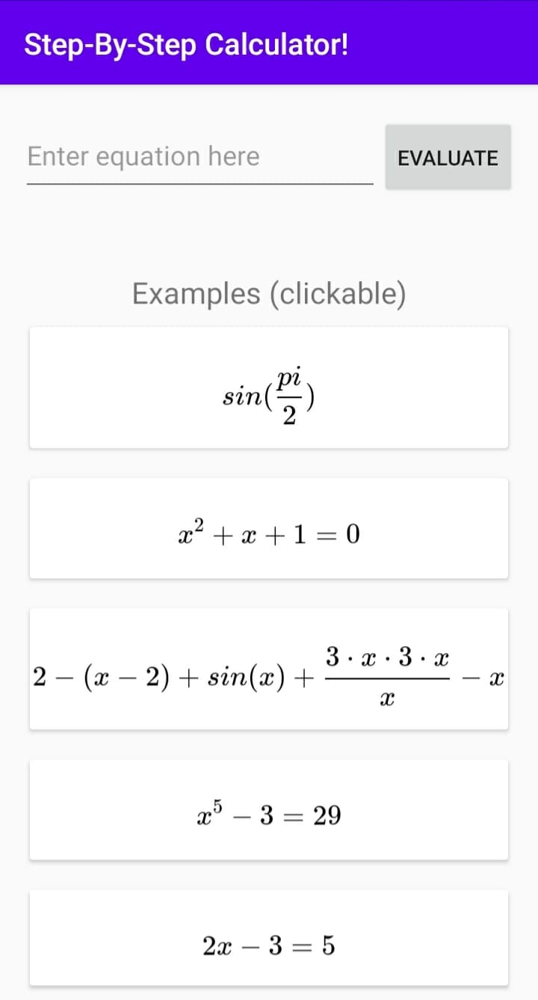
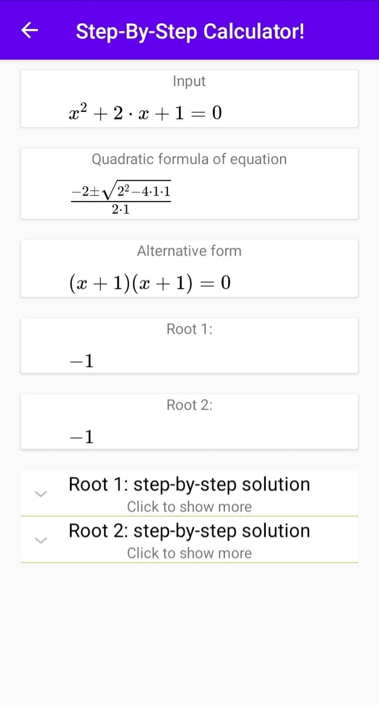
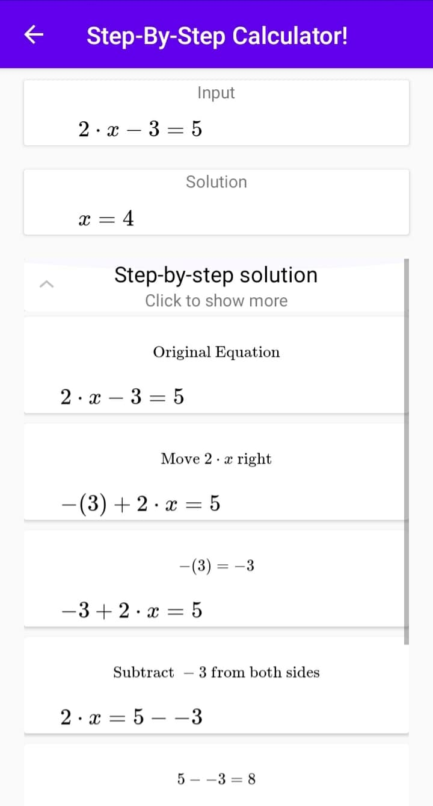

# Step by Step calculator!
This android app lets you enter an arithmetic or algebraic equation, 
and will provide you with step by step solutions to solve it.
The app is just a simple UI for demonstrating [calculator-CAS](TODO link to calculatorCAS).

Donwload the app on google play store LINK

    
    
    

